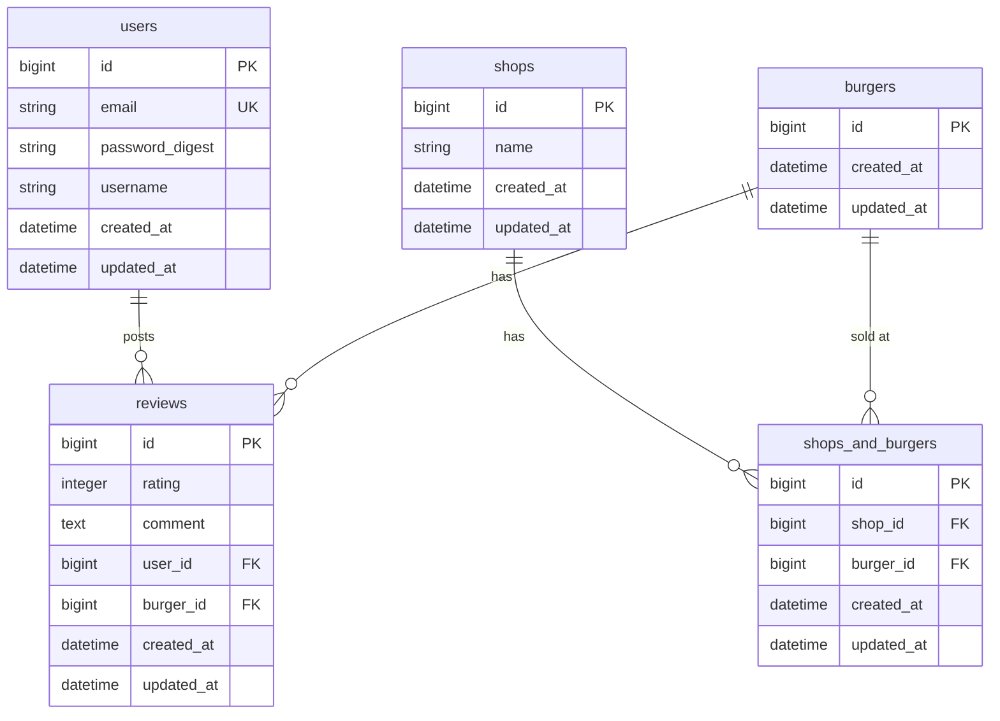

# ER図

## リレーション

| テーブル | 関係 | テーブル | 内容 |
|----------|------|----------|------|
| users | 1 対 0..* | reviews | 1人のユーザーが複数レビューを投稿 |
| burgers | 1 対 0..* | reviews | 1つのバーガーに複数レビューがつく |
| shops | 多 対 多 | burgers | shops_and_burgers を中間テーブルとした多対多 |

## 設計メモ

- `password_digest` は Rails の `has_secure_password` が使うカラム名（bcrypt でハッシュ化）
- `burgers` は現時点で `id` のみ。将来的に野菜・構成・値段カラムを追加予定
- `shops_and_burgers` の `shop_id`・`burger_id` にはそれぞれインデックスを付与する
- `shops` の API は MVP では未実装（将来対応）
