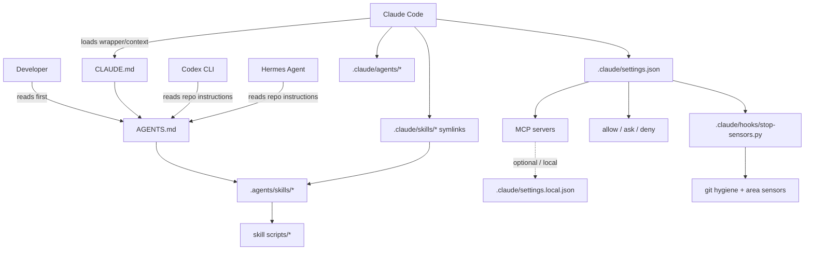

# Agent Harness Onboarding

この文書は、初見の開発者が30分で `AGENTS.md`, `.claude/`, `.agents/`, hooks, skills, subagents の関係をつかむための入口です。

## なぜハーネスがあるのか

エージェントの判断を小さく再現可能にし、秘密情報・無関係差分・検証漏れを防ぎ、人間レビューを設計判断へ集中させるためです。

## 構成図



## 責任範囲

- `AGENTS.md`: 全エージェント共通の最小ルール、検証コマンド、禁止範囲。
- `CLAUDE.md`: Claude Code が読む入口。原則 `@AGENTS.md` への薄いラッパー。
- `.agents/skills/*`: Claude / Codex / Hermes で共有する、1ジョブ単位の再利用手順。
- `.claude/skills/*`: Claude Code から `.agents/skills/*` を読むための symlink。
- `.claude/agents/*`: 調査・レビュー・テストを親コンテキストから分離する subagent 定義。
- `.claude/hooks/*`: エージェント停止時などに走る機械的な安全確認。
- `.claude/settings.json`: 共有 permission、hooks、plansDirectory、必要最小限の Claude 設定。
- `.claude/settings.local.json`: 個人ローカル設定。gitignored。共有前提にしない。
- MCP: 外部サービス接続。必要になった時だけ、最小権限で追加する。

## 日常的に触るファイル

- `AGENTS.md`: 共通ルールを短く直すとき。
- `docs/agent-onboarding.md`: 新メンバー向け説明を更新するとき。
- `.agents/skills/<name>/SKILL.md`: 頻出ワークフローを追加・修正するとき。
- `.agents/skills/<name>/references/<name>.md`: 詳細手順を長くしたいとき。
- `.agents/skills/<name>/scripts/*`: 再現可能な検証コマンドに落としたいとき。
- `.claude/agents/*.md`: subagent の責務や権限を調整するとき。
- `.claude/hooks/stop-sensors.py`: 失敗を機械的に検出できるようにするとき。

## 触ってはいけないファイル・操作

- `.env*`, `backend/.env*`, `frontend/.env*`, `secrets/**`, `backend/.kamal/secrets`, `backend/config/master.key`。
- `~/.claude`, `~/.hermes`, `~/.codex` などのグローバル設定。必要なら別PRや明示確認を取る。
- `.claude/settings.local.json` の共有前提化。個人ローカル設定として扱う。
- ユーザーが明示していない `SETUP.md`, `plans/*.md`, `memory/*`, `plan/*` の変更。
- `git push --force`, destructive reset, production deploy, secret rotation。

## エージェントがミスをしたとき

1. 失敗を観測する。例: 無関係ファイルを編集した、secret path を読もうとした、検証が抜けた。
2. 既存ハーネスへの追加で防げるか確認する。
3. 失敗の種類に応じて `AGENTS.md` / Skill / Hook のどれかを更新する。
4. 同じ条件で再実行し、再発しないことを確認する。
5. 変更理由、再現条件、確認コマンドを書いて PR にする。

```bash
# まず観測を固定する
cd /path/to/hamburger_evaluation
git status --short --branch --untracked-files=all
git diff --check
```

```bash
# hooks で防げる種類なら sensor を更新して再実行
python3 .claude/hooks/stop-sensors.py
```

```bash
# 頻出手順なら Skill に分離して Claude へ symlink
mkdir -p .agents/skills/new-workflow/references
ln -sfn ../../.agents/skills/new-workflow .claude/skills/new-workflow
```

## Claude Code の起動コマンド

通常の開発は project settings を読み、必要な確認を残せる print mode から始めます。

```bash
claude -p "Fix one small bug, use @researcher before editing, then run the required checks." \
  --allowedTools "Read,Edit,Bash(git status:*),Bash(git diff:*),Bash(pnpm run:*),Bash(docker compose run:*)" \
  --max-turns 10
```

探索的に進める場合は interactive mode を使います。大きな変更は先に plan mode に寄せてください。

```bash
claude --permission-mode plan
```

推奨フラグ:

- `--max-turns`: runaway 防止。
- `--allowedTools`: 作業に必要な権限だけ渡す。
- `--permission-mode plan`: 曖昧な実装前に方針を固定する。
- `--continue`: 同じ作業の続きだけに使う。別件は新規 session。

## Codex の起動コマンド

Codex は git repo 内で `exec` を使うのが基本です。自動実行を広げすぎないでください。

```bash
codex exec "Use AGENTS.md. Fix one small bug, keep the diff scoped, and run the matching checks."
```

長めの作業は sandboxed auto mode を使い、終了後に必ず人間が diff を見ます。

```bash
codex exec --full-auto "Implement the smallest safe fix for the selected issue and stop before committing."
```

推奨フラグ:

- `exec`: one-shot で終了条件を明確にする。
- `--full-auto`: workspace 内の変更に限って自動化したい時だけ。
- `--yolo`: この repo では原則使わない。

## MCP の扱い

MCP は便利ですが、常時接続の道具箱にしないでください。必要な外部サービスが明確な時だけ、project/local scope と権限を選びます。

```bash
# 例: この repo 専用・個人ローカルの MCP を追加する場合
claude mcp add -s local <name> -- <command>
```

共有する必要がある MCP だけ `.claude/settings.json` に入れます。個人 token やローカル path は `.claude/settings.local.json` に置きます。

## よくあるアンチパターン

- megaskill: 1つの Skill に調査・実装・レビュー・テストを全部入れる。1スキル1ジョブに分ける。
- MCP 積みすぎ: 使わない外部ツールを常時露出する。必要時だけ最小権限で足す。
- `CLAUDE.md` 500行超: Claude 固有の巨大マニュアルにしない。共通ルールは `AGENTS.md`、詳細は docs/Skill へ。
- hook で重すぎる検証を毎回走らせる: 変更範囲を見て必要な sensor だけ走らせる。
- 親コンテキストで grep し続ける: code pattern 探索は `researcher` subagent に渡す。
- style 指示の増殖: インデントや引用符は formatter/linter に任せる。
- secret を「確認だけ」と言って読む: 値を見なくても path に触らない設計にする。

## Slack で相談する

迷ったら社内の `#ai-coding` チャンネルで、次の3点を添えて相談してください。

```text
1. 何をエージェントに頼んだか
2. どのファイルが変わったか
3. どのハーネスで防ぐべき失敗に見えるか: AGENTS.md / Skill / Hook / settings
```

チャンネル名が違うチームでは、近い用途の AI coding / developer productivity チャンネルに読み替えてください。

## Hello Harness タスク

新規メンバーは、既存の小バグ1件をエージェント主導で修正して PR するところまでを最初の練習にします。

1. issue か小さな不具合を1件選ぶ。secret や deploy を含むものは避ける。
2. Claude Code または Codex を `AGENTS.md` 付きで起動する。
3. `researcher` subagent で既存 pattern を探させる。
4. エージェントに最小修正を実装させる。
5. 変更範囲に応じて Skill または `stop-sensors.py` を実行する。
6. `pr-self-review` で unrelated changes と検証漏れを確認する。
7. diff を人間が読み、必要なら reviewer subagent に批判的レビューを依頼する。
8. PR を作成し、Summary / Tests / Notes を書く。

```bash
# Hello Harness の最後に最低限見るもの
git status --short --branch --untracked-files=all
git diff --stat
python3 .claude/hooks/stop-sensors.py
```

## Required reading

- Hashimoto: [My AI Adoption Journey](https://mitchellh.com/writing/my-ai-adoption-journey)
- OpenAI: [AGENTS.md](https://agents.md/)
- Anthropic: [Claude Code Best Practices](https://www.anthropic.com/engineering/claude-code-best-practices)
- Fowler/Böckeler: [Exploring Gen AI](https://martinfowler.com/articles/exploring-gen-ai.html)
- HumanLayer: [12-Factor Agents](https://github.com/humanlayer/12-factor-agents)
