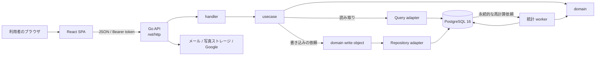

# BurgerStack の全体設計

## この文書の目的

BurgerStack は、ハンバーガーを食べた体験をレビューとして共有し、ショップやバーガーの評価を探せる Web アプリケーションです。

この文書では、個々の API や画面の仕様ではなく、システム全体をどのように分け、どの責務をどこに置き、なぜその形を選んでいるかを説明します。実装時の詳細な規約は [`CLAUDE.md`](../CLAUDE.md)、フロントエンドのディレクトリ構成は [`frontend/README.md`](../frontend/README.md) を参照してください。

## 設計の要約

BurgerStack の設計は、次の考え方を軸にしています。

1. **業務ルールの正解をバックエンドに一つだけ置く**
   評価の計算、入力の妥当性、閲覧・更新の権限といった判断は Go の domain に集めます。フロントエンドは同じルールを作り直さず、入力、説明、表示、API が返したエラーの案内に集中します。

2. **依存を内側へ向ける**
   バックエンドは handler → usecase → domain の順に内側へ依存します。domain は HTTP、PostgreSQL、フレームワークを知らないため、業務ルールを外部技術から独立させて変更・テストできます。

3. **読み取りと書き込みを分ける**
   画面へデータを返す読み取りは Query、状態を変える書き込みは domain の書き込みオブジェクトを通します。用途の違う処理を一つの巨大な repository に集めず、変更の影響範囲を小さくします。

4. **重要な整合性は、アプリケーションの注意力だけに頼らない**
   トランザクション、DB 制約、行ロック、永続的な再計算依頼を使い、並行実行やプロセス停止があってもデータの意味が壊れにくい構成にします。

5. **境界を文章だけでなくコードとテストで守る**
   パッケージの依存、interface の命名、domain の標準ライブラリ限定などを構造テストでも検査します。設計規約が実装の成長とともに形骸化することを防ぎます。

## システム構成



システムは大きく React SPA、Go API、PostgreSQL の三つに分かれます。

- **React SPA** は画面、ルーティング、フォーム状態、API 通信を担当します。
- **Go API** は認証、認可、入力検証、ユースケースの進行、業務ルールを担当します。
- **PostgreSQL** は永続データ、制約、トランザクション、非同期処理の依頼を保持します。

フロントエンドの API ベースパスは既定で `/api` です。開発時は Vite の proxy が Go API へ転送し、本番でも SPA と API を同一 origin 配下で公開できる形を想定しています。

## フロントエンド

### 責務の分け方

フロントエンドは機能単位の `domains/<name>` を中心に構成します。認証、ショップ、レビュー、ユーザーなどの機能ごとに API 呼び出し、hook、page を近くに置きます。

共通部分には明確な役割があります。

- `app`: provider、router、アプリケーションの外枠
- `api/client`: HTTP 通信の共通境界
- `states`: 認証などのクライアント共有状態
- `components`: 複数機能で使う UI 部品
- `lib`: UI やドメイン機能に属さない小さな共通処理

状態管理も種類ごとに分けます。サーバーから取得する状態は SWR、認証などのクライアント共有状態は Jotai、フォーム内の一時的な状態は react-hook-form が担当します。

### API を唯一の判断主体にする

フロントエンドは利用者に早い反応を返すための UI を持ちますが、業務上の最終判断はしません。例えば、更新ボタンの表示は API が返す権限情報に従い、送信内容が有効かどうかは API の検証結果を表示します。

この方針には二つの利点があります。

- ブラウザを経由しない API 呼び出しでも同じルールが適用される。
- backend と frontend で同じ定数や条件を二重管理せずに済む。

### HTTP 境界で表記を変換する

API の JSON は Go に自然な `snake_case`、TypeScript のコードは `camelCase` を使います。変換と Bearer token の付与は `frontend/src/api/client/buildApiClient.ts` に集約し、画面や domain hook に通信上の都合を漏らしません。

認証情報が保存されている場合も、ブラウザ内の値だけでログイン済みとは判断せず、API の `/me` で利用者を復元します。401 のときは認証情報を破棄しますが、一時的な通信障害では保持します。

## バックエンド

### Clean Architecture

バックエンドの中心には、外部技術を知らない domain があります。

```text
HTTP request
    ↓
handler       HTTP、JSON、status code、middleware
    ↓
usecase       処理の順序、認証・認可、トランザクション範囲
    ↓
domain        entity、value object、業務ルール、domain error
```

- **handler** は HTTP の形をアプリケーションの入力へ変換し、結果を HTTP 応答へ戻します。
- **usecase** は一つの利用目的を完了するために必要な処理を組み立てます。
- **domain** は「何が有効か」「誰に何が許されるか」「値をどう導くか」を判断します。
- **adapter** は PostgreSQL、JWT、パスワードハッシュ、メール、写真ストレージなどの外部技術を受け持ちます。

domain が import できるのは Go の標準ライブラリだけです。これにより、HTTP や DB の都合で業務ルールの形が決まることを避けています。

### 読み取りと書き込みの分離

永続化へのアクセスは、目的に応じて二つに分けます。

| 目的 | 契約を置く場所 | 実装 | 特徴 |
|---|---|---|---|
| 読み取り | usecase の `*Query` | `adapter/query` | `Get*` / `List*` のみ |
| 書き込み | domain の `*Repository` | `adapter/repository` | 作成、更新、破棄、更新前のロック |

usecase は repository を直接呼びません。単一の集約の変更は domain の書き込みオブジェクトを通し、複数の集約をまたぐ一連の処理は Unit of Work の中で組み立てます。

SQL は `db/queries` に置き、sqlc が型安全な Go コードを生成します。生成された行構造体や pgx の型は adapter の外へ出さず、DB の形と domain の形を明示的に変換します。DB スキーマが domain model をそのまま決める構成にはしません。

### トランザクションの考え方

「一部だけ成功すると意味が壊れる」書き込みは、一つの Unit of Work に入れます。例えばレビューの保存と統計再計算の依頼は、両方を確定するか、両方を取り消します。

並行更新がある処理では行ロックを使い、複数行を扱うときは一定の順序でロックします。これは、更新の取りこぼしやデッドロックを避けるためです。アプリケーションコードで先に確認してから書くことだけに頼らず、可能な不変条件は `UNIQUE`、`CHECK`、外部キーなどでも守ります。

## データと集計

中心となるデータは利用者、ショップ、バーガー、レビューです。ショップは申請後に承認される状態を持ち、レビューは利用者、ショップ、バーガーの関係を記録します。

一覧で頻繁に使う平均評価や件数は、毎回すべてのレビューから計算せず、集計結果として保存します。ただしレビューの投稿・編集・削除を、その重い計算の完了待ちにはしません。

処理は次の流れです。

1. レビューなどの書き込みと同じトランザクションで、再計算依頼を PostgreSQL に保存する。
2. API は書き込み結果を返す。
3. background worker が依頼を取得し、domain の計算を使って集計を更新する。
4. 失敗した依頼は DB に残し、ほかの依頼を止めずに再試行する。

この構成は結果整合です。書き込み直後は古い集計が短時間表示されることがありますが、要求処理を軽く保ち、プロセスが停止しても依頼を失わずに再開できます。同じ対象への複数の依頼はまとめ、複数 worker が動いても行ロックと version によって新しい変更を取りこぼさないようにします。

## 認証とセキュリティ

通常の API 認証には custom JWT の Bearer token を使います。認証が必要な API では、token から得た利用者と対象データを基に usecase / domain が認可します。画面を隠すことだけをアクセス制御にはしません。

サインアップはメール確認を挟みます。登録済みかどうかによって受付応答を変えず、第三者がメールアドレスの登録状況を推測しにくくします。確認 token は十分な乱数から生成し、DB には平文ではなく hash を保存します。パスワードも平文では保存せず bcrypt で hash 化します。

Google sign-in は OAuth 2.0 / OpenID Connect の state、nonce、PKCE を検証し、ブラウザから API token へ交換する値は一回限りにします。外部の MCP client へ認可する OAuth server も任意で有効化でき、同意と grant を API 側で管理します。

設定値は、安全な既定値を推測できないものが欠けていれば起動を失敗させます。特に JWT、メール、外部認証の秘密はログや文書へ出さず、環境から渡します。

## 外部サービスとの境界

外部サービス固有の詳細は adapter に閉じ込めます。

- 写真は local disk または S3 互換 storage を同じ interface の背後で切り替えます。
- メールは usecase から「確認メールを送る」という意図で依頼し、SMTP の本文や応答の扱いは adapter が受け持ちます。
- Google の token や user info の通信は認証 adapter が受け持ちます。
- MCP の tool は別の業務ロジックを持たず、既存の usecase を呼びます。

外部サービスを変えるときに、domain のルールまで書き換えないための境界です。

## エラーと言語

利用者に見える API の 4xx エラーは、`Accept-Language` に応じて日本語または英語を返します。domain は表示文そのものではなくメッセージの意味を表す値を返し、HTTP 境界で言語を選びます。

一方、OAuth など標準仕様で決められた識別子や、内部障害の詳細は安易に翻訳・公開しません。5xx は利用者へ内部情報を漏らさず、詳細はサーバー側のログで追跡します。

## 起動、停止、障害への姿勢

API の composition root は `backend-go/cmd/api/main.go` です。設定、DB pool、adapter、domain の書き込みオブジェクト、usecase、handler を明示的に組み立てます。暗黙の global dependency を避け、どの実装がどの契約を満たすかを追いやすくしています。

HTTP server には timeout を設定し、停止時は新しい受付を止めてから処理中の要求と worker を待ち、最後に DB pool を閉じます。worker の依頼は PostgreSQL に残るため、停止時間を超えた処理も次回起動後にやり直せます。

不正な設定や必須設定の欠落は、動作中の曖昧な障害にせず起動時に検出する `fail-loud` を基本にします。

## テストと設計の維持

テストは振る舞いだけでなく、設計上の境界も対象にします。

- domain の単体テストで業務ルールを確認する。
- handler / usecase のテストで HTTP 契約や処理の進行を確認する。
- 実際の PostgreSQL 16 を使う統合テストで migration、制約、query、repository を確認する。
- frontend の Vitest で component、hook、API 境界を確認する。
- 構造テストで domain の依存、Query / Repository の責務、書き込みオブジェクトの肥大化を検査する。
- CI で format、vet、build、type check、lint、test を実行する。

DB 統合テストは `TEST_DATABASE_URL` がない環境では skip されるため、DB 周辺を変更したときは明示的に PostgreSQL 16 を起動して実行します。「テストコマンドが成功した」ことと「必要な統合テストが実行された」ことを区別します。

## この設計が目指すもの

BurgerStack は、抽象化そのものを目的にしたシステムではありません。目指しているのは、利用者に見えるルールを一か所で説明でき、失敗や並行実行があってもデータを守れ、個人でも変更と運用を続けられる構成です。

そのため、新しい機能を追加するときも次の順で考えます。

1. 利用者にとってのルールを domain の言葉で定義する。
2. usecase がその目的を達成する順序と整合性の範囲を決める。
3. handler と adapter が HTTP、DB、外部サービスへ翻訳する。
4. frontend が API の結果を利用者に分かる形で届ける。
5. テストで振る舞いと境界の両方を固定する。

この順序を守ることで、UI、データベース、外部サービスが変わっても、サービスの中心にある意味を保ちやすくしています。
