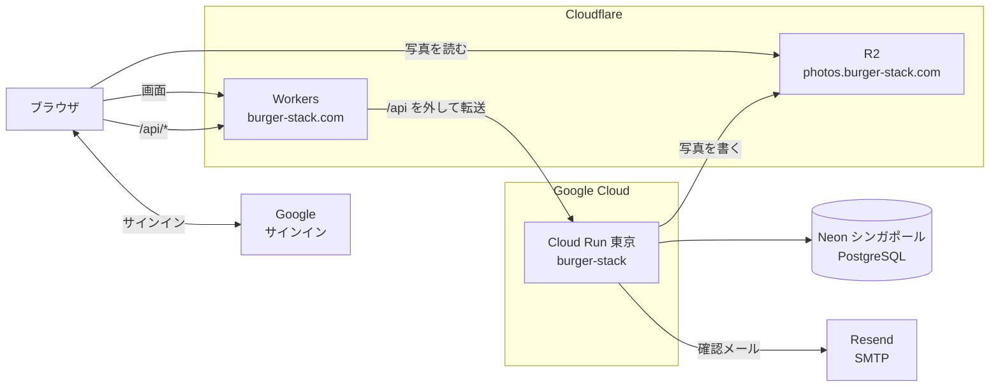

# インフラ構成

BurgerStack の本番は、5 つの外部サービスの組み合わせで動いています。どれも無料枠から始めていて、20 候補を実際にデプロイして比べたうえで選びました。この文書は、いまの構成と、設定がどこにあるかの地図です。

- 配り方(CD)と初回の準備: [本番へのデプロイ](production-deploy.md)
- なぜそれを選んだか: [ADR](adr/)(技術判断の記録)
- 比べたときの計測: [計測記録](benchmarks/)

## 全体像

ブラウザから見ると、画面も API も `burger-stack.com` の同じオリジンです。`/api/*` だけを Worker が Cloud Run へ転送するので、CORS の設定は要りません。写真だけは別のドメインから、R2 が直接配信します。

## 構成要素

| 層 | サービス | 場所 | 公開の入口 | 無料枠(2026-09 時点) | 判断 |
|---|---|---|---|---|---|
| フロントエンド | Cloudflare Workers(Static Assets) | 全世界のエッジ | `https://burger-stack.com` | 静的ファイルと帯域は無料・無制限。Worker の実行は 10 万回/日 | [ADR-0001](adr/0001-frontend-deploy-target.md) |
| API | Google Cloud Run(1GB) | 東京 `asia-northeast1` | Worker 経由のみ(`*.run.app` にも直接届く) | 200 万リクエスト/月、vCPU 18 万秒/月。**カード必須・超過で課金** | [ADR-0002](adr/0002-backend-deploy-target.md) |
| データベース | Neon(PostgreSQL) | シンガポール | — | 保存 0.5GB、コンピュート 100 CU 時間/月 | [ADR-0003](adr/0003-database-hosting.md) |
| 写真 | Cloudflare R2(バケット `burger-stack`) | 全世界 | `https://photos.burger-stack.com` | 保存 10GB、転送量は無料・無制限。**カード必須** | [ADR-0004](adr/0004-photo-storage.md) |
| メール | Resend(SMTP) | — | — | 3,000 通/月、100 通/日 | [ADR-0006](adr/0006-email-delivery.md) |
| 非同期処理 | DB の待ち行列 + API 内のワーカー | Cloud Run の中 | — | — | [ADR-0005](adr/0005-async-job-platform.md) |

**請求の上限はありません。** Cloud Run と R2 はカードを登録していて、無料枠を超えた分は課金されます。Google Cloud の予算アラートは通知するだけで、支払いを止めません。

## ドメイン

`burger-stack.com` は Cloudflare で管理しています(ネームサーバーが Cloudflare)。

| ホスト名 | 向き先 | 設定した場所 |
|---|---|---|
| `burger-stack.com` | Worker `hamburger-frontend` | Cloudflare のダッシュボード(Worker → Settings → Domains & Routes) |
| `photos.burger-stack.com` | R2 のバケット `burger-stack` | Cloudflare のダッシュボード(R2 → バケット → Settings → Custom Domains) |
| `<版>-hamburger-frontend.<アカウント>.workers.dev` | Worker の各版のプレビュー | `frontend/wrangler.toml` の `preview_urls = true`。CD が切り替え前の確認に使う |
| `burger-stack-421794940461.asia-northeast1.run.app` | Cloud Run | Cloud Run が自動で付ける。Worker の転送先(`wrangler.toml` の `API_ORIGIN`) |

## 設定の置き場所

設定は 6 か所に分かれています。**秘密の値はどれもリポジトリに書きません。**

| 置き場所 | 何を置くか | 変え方 |
|---|---|---|
| Cloud Run の環境変数 | API の設定と秘密のすべて(`DATABASE_URL`、`JWT_SECRET`、`SMTP_*`、`MAIL_FROM`、`APP_BASE_URL`、`GOOGLE_*`、`OAUTH_*`、`PHOTO_*`) | Cloud Run のコンソール。**切り替え前の確認を通らずに本番へ出る**ので注意 |
| GitHub の Production 環境 | CD が使う値(Cloudflare のトークン、マイグレーション用の DB の URL、GCP の入口の情報) | Settings → Environments → Production。main からしか使えない |
| `frontend/wrangler.toml` | Worker の設定と、転送先の `API_ORIGIN` | PR で変える。CD が配る |
| Cloudflare のダッシュボード | 独自ドメイン、R2 のバケット、DNS | ダッシュボード |
| Google Cloud | OAuth クライアント(戻り先の URI)、Workload Identity、サービスアカウントの権限 | コンソールか Cloud Shell |
| Resend | 送信ドメインの検証、API キー | ダッシュボード |

API の主な URL 系の設定は次のとおりです。

| 変数 | 値の形 |
|---|---|
| `APP_BASE_URL` | `https://burger-stack.com`(確認メールのリンクと、許可の画面の URL の元) |
| `GOOGLE_REDIRECT_URL` | `https://burger-stack.com/api/auth/google/callback`(Google Cloud の OAuth クライアントにも同じ値を登録する) |
| `PHOTO_PUBLIC_BASE_URL` | `https://photos.burger-stack.com`(末尾に `/` を付けない) |
| `OAUTH_ISSUER` | API 自身の公開 URL |

## デプロイ

main に入った変更は、GitHub Actions が本番へ配ります。詳しくは [本番へのデプロイ](production-deploy.md) にあります。

| 対象 | ワークフロー | 流れ |
|---|---|---|
| フロントエンド | `deploy-frontend.yml` | ビルド → 版をアップロード → プレビュー URL で確かめる → 切り替える → 本番を確かめる |
| API | `deploy-api.yml` | マイグレーション → 要求を流さないリビジョンを作る → 専用の URL で確かめる → 切り替える → 本番を確かめる |

どちらも、切り替えたあとの確認に落ちたら直前の版に自動で戻します。**Cloud Run のコンソールの継続的デプロイは無効にしてあります**(経路が 2 本になって後勝ちになるため)。

## 既知の課題

| 課題 | 影響 | 対応 |
|---|---|---|
| 要求がない間、Cloud Run のインスタンスが 0 になる | 統計の再計算ワーカーも止まり、次の起動まで統計の反映が遅れる | いまは許容。確実に動かすなら最小インスタンス 1 か外部 cron([ADR-0005](adr/0005-async-job-platform.md)) |
| 定期実行(全件再計算・期限切れ行の削除)が未実装 | `oauth_token_sessions` と `mail_deliveries` の行が溜まり続ける | [ADR-0005](adr/0005-async-job-platform.md) の 2 |
| Cloud Run の環境変数をコンソールで変えると、確認を通らずに本番へ出る | 起動できない設定を入れると、そのまま落ちる | 変えるときは「すぐに配信する」を外し、タグ付きの URL で確かめてから切り替える |
| バックアップが Neon の無料枠の保持期間だけ | 長期の復元ができない | データが増えたら週次の `pg_dump` を R2 へ |
| 送信ドメインがまだ `burger-stack.com` ではない | — | Resend で `burger-stack.com` を検証し、`MAIL_FROM` を変える([ADR-0006](adr/0006-email-delivery.md)) |
| 開発用の `r2.dev` の公開 URL が有効 | レート制限つきの別経路が残っている | 独自ドメインでの表示を確かめたら止める |

## 検証の記録

構成を決める前に、5 層 × 4 候補を本物のアプリで動かして比べました。

- [検証の計画](deploy-verification-plan.md) と [手順書](deploy-verification-runbook.md)
- 計測記録: [benchmarks/](benchmarks/)。層ごとの候補の解説(`phase*-candidates.md`)、まとめ(`phase*-summary.md`)、生データ(`raw/`)
- 計測に使ったスクリプト: `scripts/bench/`。接続情報は `backend-go/.env.bench`(`.env.bench.example` を写して作る。Git に入れない)

一番の学びは、**無料枠の落とし穴は料金表に書いていない**ことでした。20 候補すべてで、実際にデプロイするまで分からない制約に当たっています。
